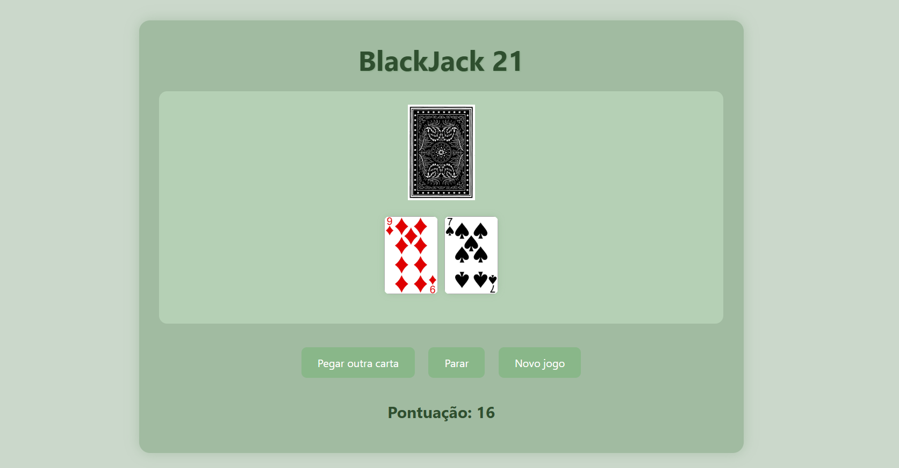

# Jogo de Cartas - BlackJack 21

Uma aplicação web interativa do clássico jogo **Blackjack (21)**, desenvolvida com HTML, CSS e JavaScript.

O jogador interage com o baralho buscando atingir o valor mais próximo de 21 sem ultrapassar, manipulando as cartas e a pontuação em tempo real por meio de estruturas de dados e lógica em JavaScript.

<p align="center">
  
</p>

## Tecnologias


## Demonstração

Acesse o projeto publicado:

[**Visualizar o BlackJack 21**](https://anacrisbrito.github.io/Blackjack/)

## Funcionalidades

- **Mecânica clássica de 21:** Compra de cartas, parada estratégica e reinício de partida.
- **Estruturas de Dados:** Implementação de conceitos de **pilha** e **fila** para o gerenciamento do baralho e ordem de compra das cartas.
- **Cálculo Dinâmico:** Atualização automática e em tempo real da pontuação da mão do jogador.
- **Renderização Visual:** Exibição dinâmica das cartas a partir de manipulação do DOM.
- **Interface Intuitiva:** Layout temático estilizado com CSS responsivo.

## Estrutura do Projeto

```text
Blackjack/
├── assets/
│   ├── cards/
│   │   ├── 2_of_clubs.png
│   │   ├── 2_of_diamonds.png
│   │   └── ... (todas as 52 cartas do baralho)
│   └── blackjack.preview.png
├── css/
│   └── estilo.css
├── js/
│   └── blackjack.js
├── index.html
└── README.md
```

## Como Executar

1. Clone o repositório
```bash
git clone [https://github.com/AnaCrisBrito/Blackjack.git](https://github.com/AnaCrisBrito/Blackjack.git)
```

2. Acesse a pasta do projeto
```bash
cd Blackjack
```

3. Execute o projeto
Abra o arquivo `index.html` em qualquer navegador web.

Não é necessário instalar dependências adicionais ou configurar um servidor para executar a aplicação.

## Objetivo

Este projeto foi desenvolvido para a faculdade durante o 2º período acadêmico como prática de **Estruturas de Dados** e **Front-End**, com foco no uso de funções JavaScript, lógica de manipulação de filas/pilhas para o baralho e integração completa com HTML e CSS.

## Autora

Ana Cristina Brito de Miranda  
Estudante de Sistemas para Internet.

Desenvolvido para fins acadêmicos, estudo e prática em desenvolvimento Web.